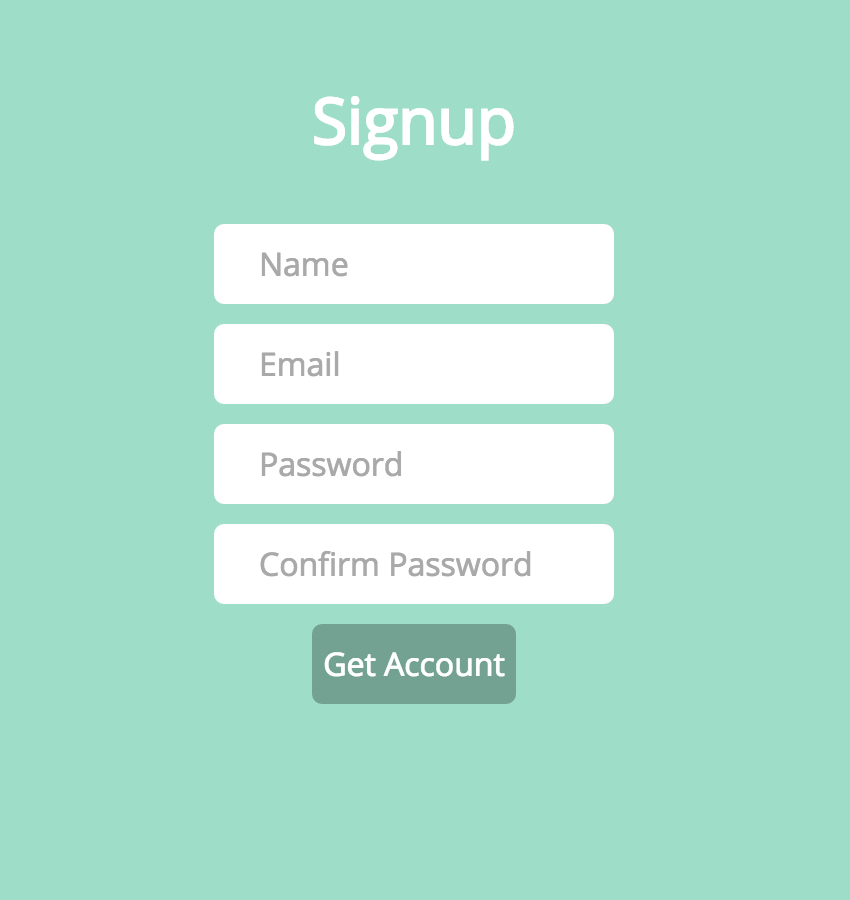

# poemy
poem collaboration app



#CONFIG

should be like

```
var config = {
    //port for server listenting
    port: '3000',
    //where the poem database is, don't forget the path
    databaseUrl: 'host:port/test'
};

module.exports = config
```

User validation inspired by and in somecases shamelessly copied from https://github.com/braitsch/node-login, rewritten to remove custom cryptology and instead use bcrypt

User Authentication created with the help of this great article https://medium.com/opinionated-angularjs/techniques-for-authentication-in-angularjs-applications-7bbf0346acec
